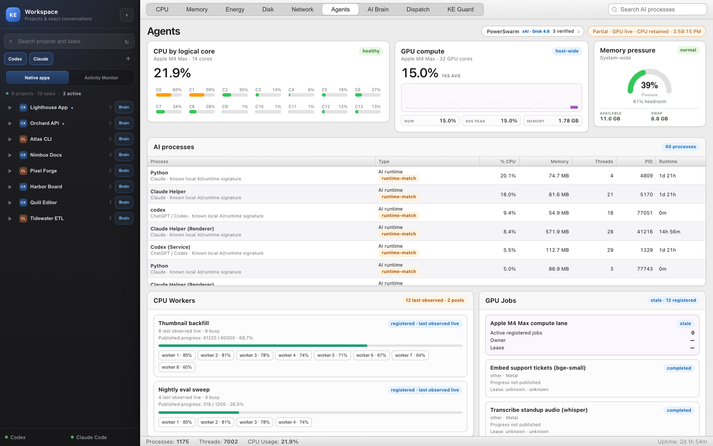
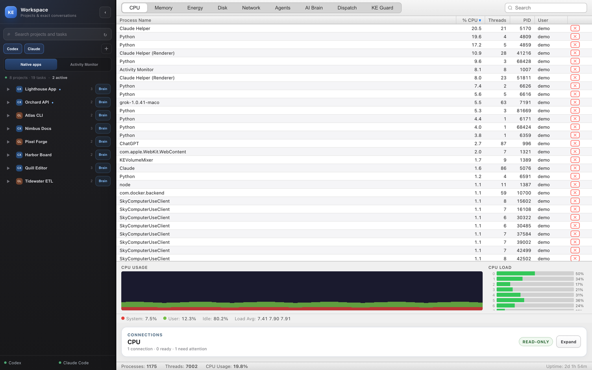
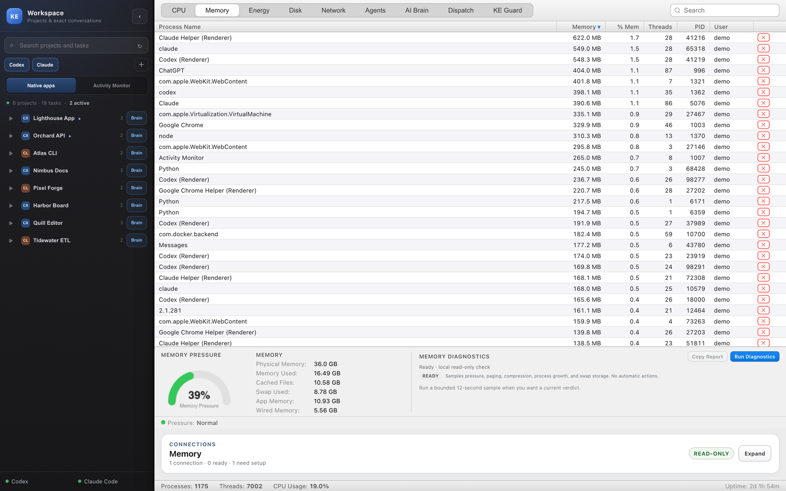
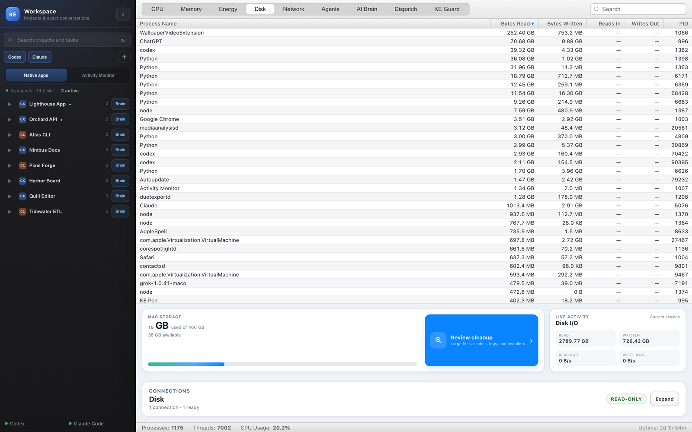
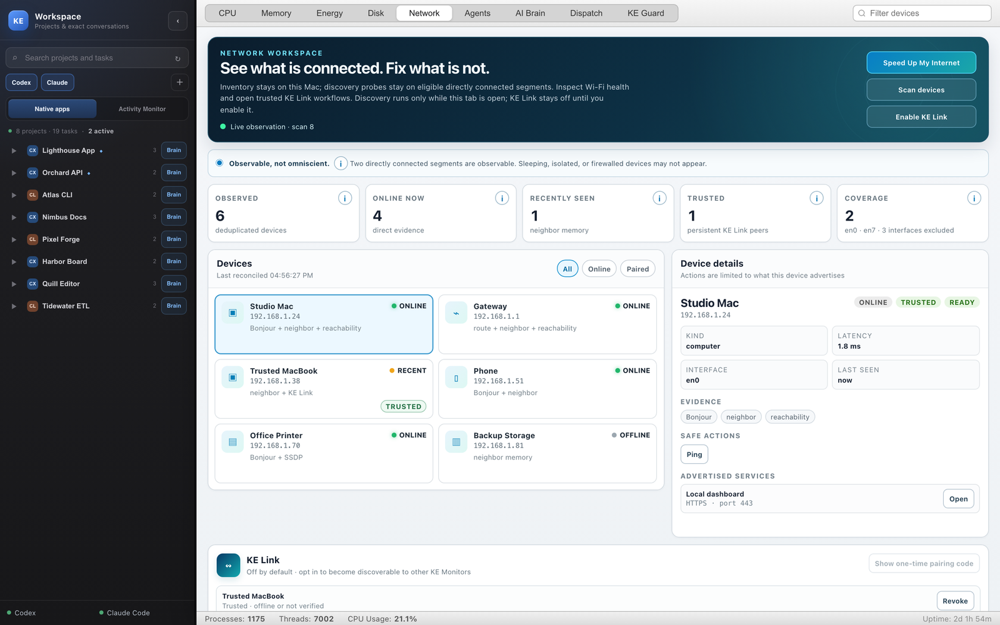
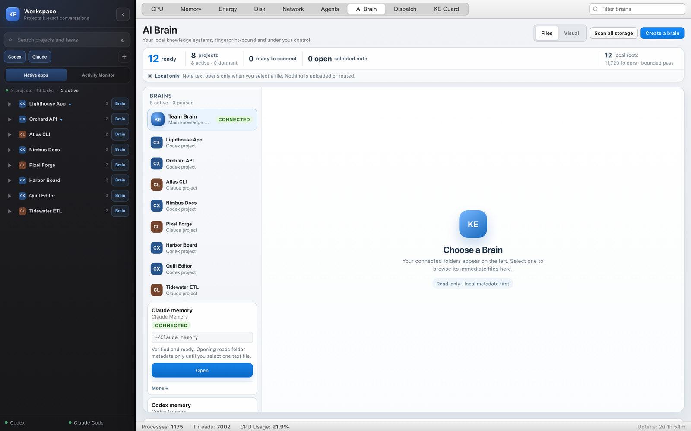
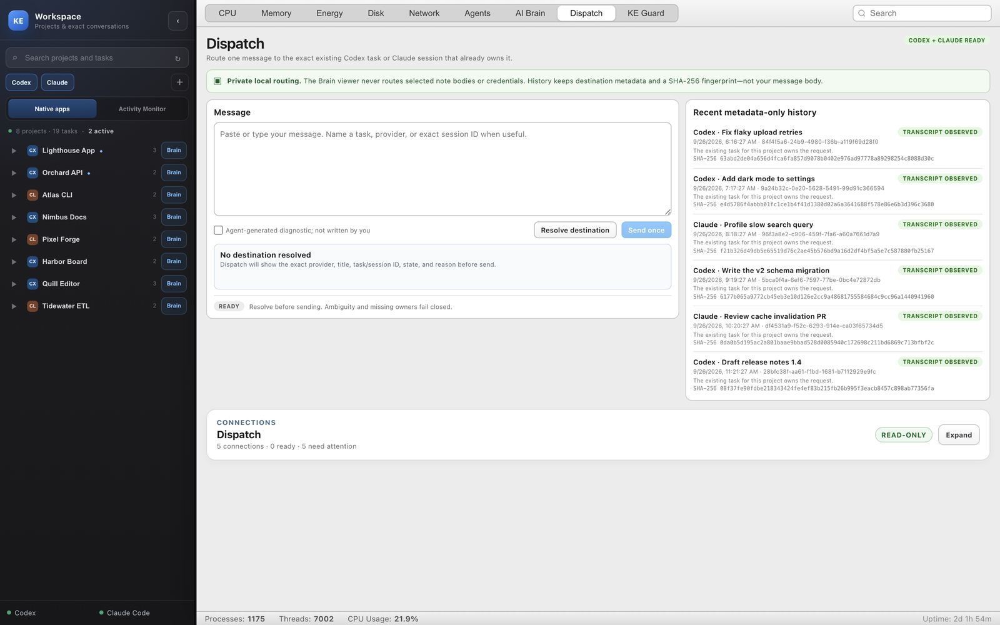
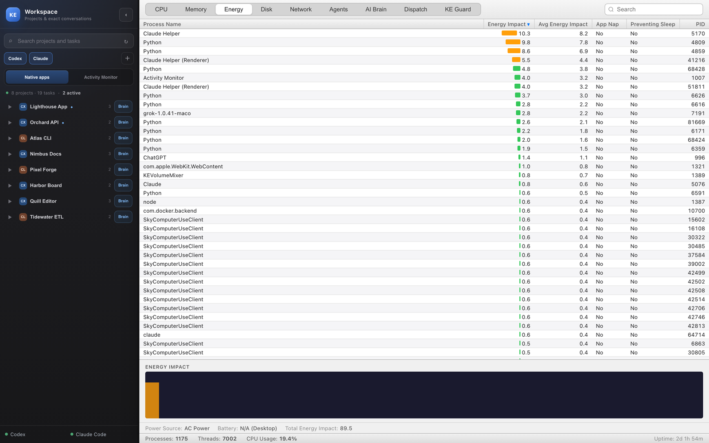
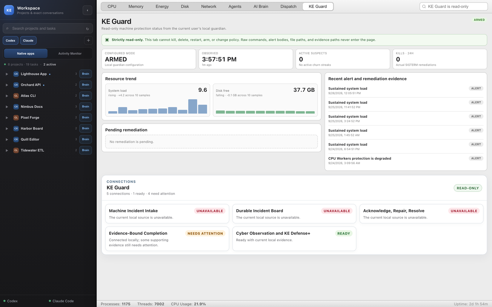

# KE Activity Monitor

**A Mac activity monitor for people who run AI agents.** It has the CPU, Memory, Energy, Disk and Network views you expect from Activity Monitor. It adds a view of what your agents are actually doing: which processes are AI runtimes, per-core CPU load next to those processes, GPU compute, worker pools with real progress, your Codex and Claude Code projects and conversations, and the local knowledge "brains" they read from.

Everything runs locally. Nothing is uploaded, and nothing changes on your Mac unless you click an explicit action.

Tour with screenshots: [huggingface.co/spaces/willykeenan/activity-monitor](https://huggingface.co/spaces/willykeenan/activity-monitor)



<sub>These screenshots come from the real app with real telemetry from a Mac. Project, task, brain and host names are invented (see [how they were made](docs/screenshots/README.md)).</sub>

## What each tab does

| Tab | What you get |
| --- | --- |
| **CPU** | Every process with live % CPU, threads and user; a CPU history graph and a live bar for each logical core. |
| **Memory** | Memory used per process, plus macOS memory pressure (from `memory_pressure`), swap and compression. **Run Diagnostics** takes a 12-second sample and gives a Healthy, Attention or Critical verdict with the evidence behind it. |
| **Energy** | Energy impact per process, with App Nap and "preventing sleep" flags. |
| **Disk** | Bytes read and written per process, read from the kernel's own counters. Also storage used on your data volume, and a **Cleanup Assistant** that finds large caches, logs, installers and old downloads. It only reveals them in Finder; it never deletes anything. |
| **Network** | Devices on your local network, found through ARP, Bonjour and SSDP, but only while the tab is open. **Speed Up My Internet** reads your Wi-Fi channel and signal and suggests a quieter channel without changing anything. **KE Link** lets two Macs running the app pair and exchange plain-text messages. |
| **Agents** | Which processes are AI runtimes (Claude, Codex, Ollama, LM Studio, PyTorch and others), with provenance labels. Also per-core CPU with co-activity, host-wide GPU compute, memory pressure, CPU worker pools and GPU jobs. |
| **AI Brain** | Finds Obsidian vaults and Claude and Codex memories on your Mac and gives each project its own brain. You can browse them as files or as an interactive constellation. It reads metadata only and opens a note's text only when you select it. |
| **Dispatch** | Sends one message to the right existing Codex task or Claude Code session, and shows why it picked that destination. It never fans out, never creates a new task, and never sends twice. |
| **KE Guard** | A read-only view of an optional local guardian daemon, if you run one. Without it, the tab says so. |

A **Workspace** rail on the left lists your Codex and Claude Code projects and their conversations. It reads metadata only (never message bodies) and opens a conversation in its own app.

<table>
<tr><td></td><td></td></tr>
<tr><td align="center"><b>CPU</b>: processes, history, per-core load</td><td align="center"><b>Memory</b>: pressure, swap, one-click diagnostics</td></tr>
<tr><td></td><td></td></tr>
<tr><td align="center"><b>Disk</b>: real per-process I/O and Cleanup Assistant</td><td align="center"><b>Network</b>: local devices, KE Link, Wi-Fi advice</td></tr>
<tr><td></td><td></td></tr>
<tr><td align="center"><b>AI Brain</b>: your local knowledge systems</td><td align="center"><b>Dispatch</b>: one message to the right agent</td></tr>
<tr><td></td><td></td></tr>
<tr><td align="center"><b>Energy</b></td><td align="center"><b>KE Guard</b>: optional guardian status</td></tr>
</table>

## Run it

It needs macOS 12 or later and Python 3.9 or later.

```bash
git clone https://github.com/willykeenan/ke-activity-monitor
cd ke-activity-monitor
python3 -m pip install -r requirements.txt
python3 activity_monitor.py
```

Node.js is optional. It enables the richer worker-pool views when the [CPU/GPU Workers](https://github.com/willykeenan/cpu-gpu-workers) plugins are installed.

### Build a standalone app

```bash
./package_app.zsh
```

This builds a universal (Apple silicon and Intel) `Activity Monitor.app` with its own Python runtime inside this folder, and a zip in `dist/`. It runs the test suite first and checks both architecture slices. The build is signed ad hoc, which is fine for your own Mac. Sharing it publicly needs a Developer ID signature and Apple notarization.

## What it will and won't do

- **Reads, doesn't change.** Killing a process, pairing a device, pinging, Wake-on-LAN and sending a Dispatch message each happen only when you click them.
- **Local only.** There is no telemetry and no account, and it never uploads anything. The only internet use is **Measure internet**, which runs Apple's `networkQuality` when you click it.
- **Metadata, not content.** The Workspace rail, Dispatch and AI Brain never read conversation or note bodies, except the one note you open.
- **Honest numbers.** Some things macOS doesn't expose: per-GPU-core utilization, which core a thread runs on, and operation counts per process. For those the app shows "host-wide", "co-activity" or "—" instead of making numbers up.
- **Hostile names are just text.** Process names and users are escaped everywhere, so a process can't inject script by naming itself ``.

## Tests

```bash
python3 -m unittest discover -s tests
```

The suite has 615 tests. They cover the process tables, memory diagnostics, the disk cleanup scanner, network discovery and KE Link pairing, the Workspace rail, Dispatch routing, brain discovery and project brains. A rendered test proves that a hostile process name stays inert.

To regenerate the screenshots:

```bash
python3 scripts/render_screenshots.py
```

## More

- [docs/DESIGN.md](docs/DESIGN.md): the detailed behavior contract for every tab.
- [docs/FLAGSHIP_NATIVE_CAPABILITIES.md](docs/FLAGSHIP_NATIVE_CAPABILITIES.md): the Connections panel and its capabilities.

Not affiliated with Apple. "Activity Monitor" is also the name of Apple's built-in app; this is a separate open-source tool by KE Studios.

Apache-2.0. See [LICENSE](LICENSE).
